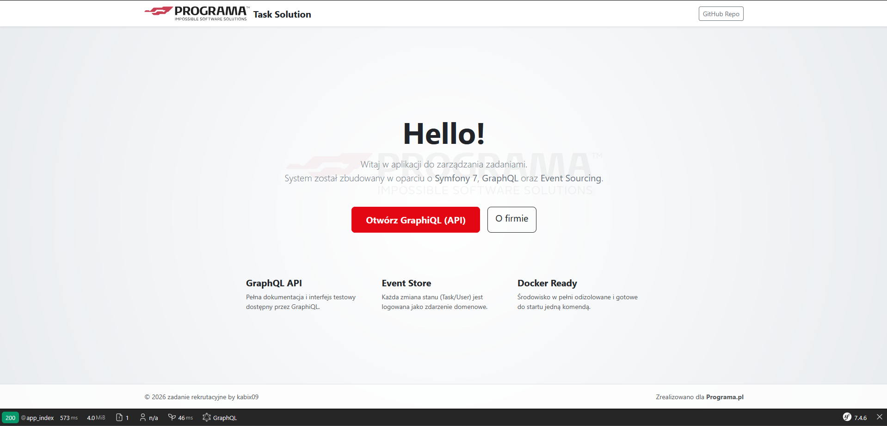

# Task Management System - Recruitment Task

A robust Headless API solution built with **Symfony 7.4**, designed with scalability and clean architecture in mind. This project implements **Domain-Driven Design (DDD)**, **CQRS**, and **Event Sourcing** patterns.



Contents
========
 * [Architecture & Patterns](#architecture--patterns)
 * [Technologies](#technologies)
 * [Get Started](#get-started)
 * [Authentication & Security](#authentication--security)
 * [Usage](#usage)
 * [GraphQL API Examples](#graphql-api-examples)
  
## Architecture & Patterns
This project follows software engineering standards like:
* **Domain-Driven Design (DDD):** Clear separation between Domain, Application, and Infrastructure layers.
* **CQRS:** Separation of write operations (Commands) and read operations (Queries) using Symfony Messenger.
* **Event Sourcing / Audit Trail:** Every state change in `Task` or `User` entities generates a Domain Event stored in the `event_store`.
* **Strategy Pattern:** Used for flexible and extensible task status validation.

## Technologies
* [PHP 8.2+](https://www.php.net/)
* [Symfony 7.4](https://symfony.com/)
* [PostgreSQL 16](https://www.postgresql.org/)
* [GraphQL (OverblogBundle)](https://github.com/overblog/GraphQLBundle)
* [JWT Authentication (LexikJWTBundle)](https://github.com/lexik/LexikJWTAuthenticationBundle)
* [Docker & Docker Compose](https://www.docker.com/)
* [Bootstrap 5](https://getbootstrap.com/)

## Get started
The project is fully containerized. You don't need PHP or Postgres installed locally.

1. **Clone the repository**
```bash
   git clone https://github.com/kabix09/ProgramaTask.git
   cd ProgramaTask
```

2. **Environment Configuration**

   The project uses `.env` for defaults. You can create a `.env.local` to override settings (e.g., ports), but it is configured to work out-of-the-box.


4. **Build and Start with Docker**

```bash
docker compose up -d --build
```

*The containers will automatically run migrations, generate JWT keys, and wait for the database to be ready.*

## Authentication & Security

The API is secured using **JWT (JSON Web Token)**. To access protected resolvers, follow these steps:

### 1. Create an Admin User

Run the following command to create your first administrator:

```bash
docker compose exec app php bin/console user:create admin@example.com tajnehaslo123 --admin
```

### 2. Login to obtain JWT Token

Send a POST request to obtain your token:

* **URL:** `http://localhost:8080/api/login_check`
* **Body (JSON):**

```json
{
  "email": "admin@example.com",
  "password": "tajnehaslo123"
}
```

### 3. Use Token in GraphQL

Add the following header to your GraphQL requests:
`Authorization: Bearer <your_token>`

## Usage

Once the containers are running, you can access the following endpoints:

* **Landing Page:** [http://localhost:8080](https://www.google.com/search?q=http://localhost:8080)
* **GraphQL Explorer (GraphiQL):** [http://localhost:8080/graphiql](https://www.google.com/search?q=http://localhost:8080/graphiql)
* **API Endpoint:** `http://localhost:8080/api/graphql/` (POST) - *Note the trailing slash*

## GraphQL API Examples

### Get Current User Data (Requires Token)

```graphql
query {
  me {
    email
    roles
  }
}
```

### Get All Tasks (Admin Only)

```graphql
query {
  allTasks {
    id
    title
    status
    user {
      email
    }
  }
}
```

### Sync Users from External API

```graphql
mutation {
  syncUsers
}
```

### Create a New Task

```graphql
mutation {
  createTask(
    title: "Zaimplementować GraphQL",
    description: "Dodać Query i Mutacje do projektu"
  ) {
    id
    title
    status
  }
}

```

### Change Task Status

```graphql
mutation {
  changeTaskStatus(
    id: "uuid-here", 
    status: DONE
   ) {
    id
    status
  }
}

```

### Get Tasks by User

```graphql
query { 
  tasksByUser(
    userId: "<your-uuid>"
  ) {
    id 
    title 
    status
  }
}
```
